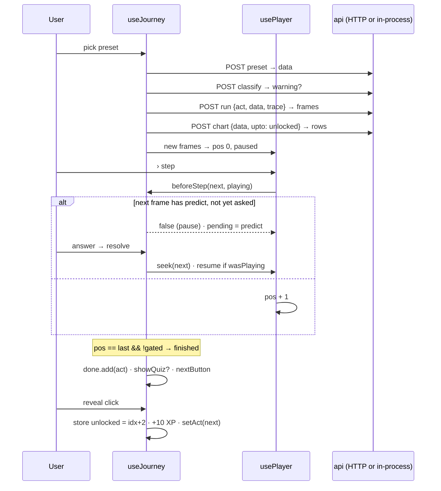

# Architecture — what every box on screen is, who owns it, and how data flows

The change → file map is in [`../README.md`](../README.md). This file answers the other
question: *what IS this thing I'm looking at, and why does it exist?* Read it before changing
anything on the stage.

## 1. The layers, and the one rule about imports

```
features/   React pages and components          (journey/, algorithms/, plus components/)
   │  imports
api/        client.ts (transport) · routes.ts (the whole HTTP API as one pure function)
   │  imports
engine/     journeys, algorithms, hashmap, chips, types — DOM-free, node-testable
   │  imports
data/       the practice-set content (problems, patterns, sql, flashcards)
lib/        store.ts (localStorage), route.ts (hash router), utils, difficulty
```

**Imports point downward.** `engine/` never imports React or touches `document`; that is what
lets `node --test` run it and lets `server/index.ts` serve it. `api/routes.ts` imports engine and
data only. Features import everything below them. A cycle is a design error.

Inside `engine/` and `api/`, relative imports carry the `.ts` extension — Node's type stripping
needs it; Vite accepts it.

## 2. The frame contract

An act is a **generator**. It yields one plain, JSON-safe object per step. That object is the
entire interface between "the algorithm" and "the screen", and it crosses the wire unchanged.

```ts
function* runHash({ nums, target }) {
  const seen = new Map()
  for (let i = 0; i < nums.length; i++) {
    const need = target - nums[i]
    yield { line: 3, i, need, seen: [...seen], hit: seen.has(need), note: "…" }
    seen.set(nums[i], i)
  }
}
```

| Field | Read by | Meaning |
|---|---|---|
| `note` | narration | **required.** One sentence, present tense. The content test rejects a frame without one. |
| `line` | code panel | pseudocode row to light; `-1` = none |
| `hold` | player | multiply the step delay — narrative frames need reading time |
| `predict` | guard in `use-journey.ts` | `{q, choices, answer}` — playback pauses *before* this frame renders |
| `noChips` | stage | story frames that open on an empty stage: need before data |
| anything else | the act's own `view()` | private state: `seen`, `L`, `R`, `counts`, `acc`, `op`… |

The engine reads the first five. Everything else is a contract between one generator and one
`view()`, which is why a new render kind needs no engine change.

**Frames are drained up front** (`drain()` in `engine/index.ts`): step-back and scrubbing become
array indexing. Cost: memory (a 20-element brute-force act is ~200 frames, under 50 KB). The
same drain runs on the server for `POST run`.

## 3. The view model — the port's one structural change

The legacy `render()` wrote HTML strings into the DOM. The port replaced it with
`view(frame, data) → StageModel`, **data describing what to draw**:

```ts
interface StageModel {
  chips: ChipModel[] | null            // null = empty stage
  panel: PanelModel                    // discriminated union, see engine/types.ts
}
type PanelModel =
  | { kind: "none" } | { kind: "story"; glyph }
  | { kind: "sum"; eq } | { kind: "need"; need, hit, target, x, map }
  | { kind: "hash"; map: HashModel } | { kind: "sorted"; label, chips, eq? }
  | { kind: "bits"; rows } | { kind: "recap"; … } | { kind: "challenge" }
```

Three consequences: the content test can assert on views without a DOM; React draws each kind
once in `features/journey/panels.tsx`; and a future non-React client (native, terminal) can draw
the same model. Adding a panel kind = one union member in `engine/types.ts` + one case in
`panels.tsx` + a `view()` that produces it.

`HashModel` (`engine/hashmap.ts`) is the bucket layout the "iceberg" draws: toy hash
`key mod buckets`, chaining, doubling past load 0.75, hop counts for the probe. `hit` (the
algorithm's verdict) and `present` (key physically in the chain) are kept apart so the panel
never claims a miss on a key it is visibly holding.

## 4. Every box on the journey page

```
┌ header: back · title · subtitle · XP · restart ────────────────────────────────┐
│ ActStepper — one node per unlocked act, one "?" for the rest                    │
├ stage (features/journey/journey-page.tsx) ────────┬ reading column ────────────┤
│ act strip · warning/info banner · data bar        │ insight + idea             │
│ Stage (panels.tsx): ChipRow → Panel               │ tools ("built from")       │
│ narration (aria-live)                             │ CodePanel (tabs, lit line) │
│ PredictCard · QuizCard · reveal · adaptive · Hints│ takeaways                  │
│ Transport (timeline, ▶ ‹ › ↺, speed)              │ StepsChart                 │
│ DataControls (preset, new, custom, params, apply) │ Legend · resources         │
└───────────────────────────────────────────────────┴────────────────────────────┘
```

| Box | Component | State it reads | Why it exists |
|---|---|---|---|
| Act stepper | `act-stepper.tsx` | `unlocked`, `actKey`, `done`, `revealed` | The learner's arc without spoiling it. Locked acts are one anonymous node — enough to promise more, not enough to name it. |
| Banner | `journey-page.tsx` | `warning`, `info` | Edge presets break the promise on purpose; the banner is what stops that being a bug report. |
| Chip row | `chip-row.tsx` | `model.chips` | The single source of truth on screen. Every approach renders the *same* input here so approaches are comparable. |
| Panel | `panels.tsx` (+ `hash-map-view.tsx`) | `model.panel` | The approach-specific half: what the approach *holds*. |
| Narration | `journey-page.tsx` | `frame.note` | The star of the page. Fixed min-height so the layout never jumps. |
| Predict / quiz / hints / reveal | `cards.tsx`, hook | `pending`, `showQuiz`, `hintsOffered`, `nextButton` | The learn-by-doing interruptions. Order in the DOM = order of importance. |
| Transport + data | `controls.tsx` | `player`, `presetKey`, `data` | A timeline, not a progress bar — every frame exists, so dragging backwards is free. |
| Code panel | `code-panel.tsx` | `act.code`, `frame.line`, `prefs.codeTab` | Languages are line-for-line against the pseudocode so one index lights the right row in any tab. |
| Steps chart | `steps-chart.tsx` | `chart` rows (API, `upto = unlocked`) | Comparison is the point; spoiling is not. The API filters, the UI never sees locked rows. |
| Challenge | `challenge-editor.tsx` | own state + `scorecard:<slug>` | Watching ≠ writing. Runs in a Blob Worker; the main thread never evals. |

## 5. The state machine (`features/journey/use-journey.ts`)

`useJourney(journey)` is the only place policy lives. Data flow per user action:



**Where each policy lives**

| Policy | Code |
|---|---|
| Frames per act/data/trace | effect on `[slug, actKey, data, trace]` → `api.run` |
| Predict before render, once per timeline | `guard` + `asked` ref (positions asked), cleared when frames arrive |
| Finished = last frame, unless the act is gated on a green challenge | `finished`, `gated` |
| Quiz shown only when the next act is still locked and the quiz was not passed before | `showQuiz` |
| Only writer of `unlocked:<slug>` | `nextButton.onClick`, `restart` |
| Hints after 45 s idle or 2 wrong answers | idle effect on `[player.pos, actKey]`; `quiz.onWrong` |
| Adaptive offer: zero wrong + first-try green | `onChallengePass` |
| URL mirrors act/step (debounced 300 ms) | `replaceQuery` effect |

**React Compiler rules.** ESLint runs `react-hooks` v7 with the compiler's rules: no `setState`
synchronously inside an effect, no ref reads during render, no mutation of props/frames. Two
patterns satisfy them: **adjust during render** (`if (frames !== prevFrames) { setPrev…; setPos(0) }`
in `use-player.ts`, the draft reset in `controls.tsx`) and **derive, don't sync** (`finished`,
`showQuiz`). Async `setState` inside `.then()` is fine.

## 6. Motion

`use-flip.ts` implements FLIP over `[data-k]` elements: measure after every commit, animate
survivors from their previous rect, scale-fade newcomers. Identity keys: `i<n>` (input chips),
`s#<n>` (sorted view), `m<key>` / `b<key>` (hash pills / bucket cells), `v<value>#<occurrence>`
(bars — value plus how many equal values came before, so a swap keeps both keys). The array row
and the panel are separate scopes because sorted copies reuse `i<n>` keys.

Duration `clamp(80, delay × 0.4, 280) × motion`, where motion is the stored pref
(calm 0.6 / normal 1 / cinematic 1.8 / off 0) and `prefers-reduced-motion` forces 0.

## 7. The API surface (`api/routes.ts`)

One function, `route(method, path, body) → {status, body}`, mounted three ways with zero
duplication:

| Mount | File | When |
|---|---|---|
| Vite middleware | `server/vite-api.ts` | `vite dev` / `vite preview` — the browser makes real HTTP calls |
| Standalone | `server/index.ts` (`node:http`, CORS `*`) | `npm run api` — any other client |
| In-process | `api/client.ts` when no server is configured | static hosting; identical results, no latency |

The client picks HTTP when `import.meta.env.DEV` or `VITE_API_URL` is set. `docs/API.md` is the
contract. The API is stateless by design: the engine has no state to leak.

## 8. State — everything is localStorage, nothing leaves the browser

`lib/store.ts` owns every key behind `useSyncExternalStore`, with an in-memory cache and a
`dsa:` prefix. Keys and writers are tabled in `FEATURES.md` §6. `unlocked:<slug>` is the
progressive-disclosure ledger; every path that advances it goes through the explicit "I get it"
click.

## 9. Invariants — break these and the product breaks

1. **Engine stays DOM-free and JSON-safe.** Tests and the server depend on it.
2. **No unearned names.** Tested on content; the shell has a known leak (B8).
3. **Every frame has a `note`; code tabs match pseudocode line-for-line.** Tested.
4. **Every UI preference goes through `lib/store.ts`.** No component reads `localStorage`.
5. **Palette lives in `src/index.css` only.** Components use tokens (`chart-1`…`chart-5`, `yellow`, `teal`).
6. **New animation honours reduced motion.**
7. **`legacy/visualizer/` is read-only reference.** Excluded from tsc, eslint, prettier.

## 10. Verification — what "done" means here

```
npm run check      # tsc -b · eslint · node --test  (all must exit 0)
npm run build      # vite build
npm run dev        # then drive the page — the UI has no automated test yet (B2)
```

Node tests are necessary and not sufficient: a rule can read correctly and still render wrong.
This round's UI verification was done in headless Chrome over CDP (see the worklog); B2 makes
that repeatable.
